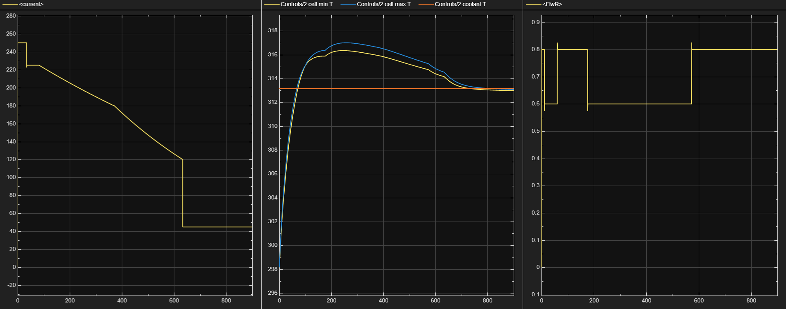

# Tesla 4680 Battery Fast Charging: Enhanced Current Control System

## Overview

This repository contains the simulation framework and results for enhanced current control and preheating systems for Tesla 4680 battery fast charging. My research demonstrates 240-2430% improvement in charging performance across temperature ranges while maintaining thermal safety margins.

**Key Achievements:**
- Commercial-grade performance: 250A peak current matching Tesla Supercharger specifications
- Multi-temperature validation: Safe operation from -10°C to 40°C
- Thermal safety: Peak temperatures maintained below 57°C in all scenarios
- Energy efficiency: 2.18:1 positive return on preheating energy investment
- Cold weather breakthrough: 40.8% SOC gain with preheating, 26.6% without preheating at -10°C

## Paper

**"Enhanced Current Control and Preheating System for Tesla 4680 Battery Fast Charging: Multi-Temperature Performance Analysis and Energy Efficiency Validation"**

- **Preprint:** EngrXiV: (https://doi.org/10.31224/5415) 
- **Authors:** [Thang Quoc Ly]

## Research Highlights

- **Multi-temperature validation:** -10°C to 40°C operating range
- **Advanced current control:** 250A peak capability vs 4-60A baseline
- **Thermal safety analysis:** Comprehensive temperature management
- **Energy economics:** Quantified preheating return on investment

## Repository Contents

- `src/matlab/` - MATLAB simulation scripts
- `src/data/` - Simulation parameters and results
- `src/figures/` - All paper figures and visualizations
- `src/docs/` - Setup and usage documentation

## Key Results Visualization

See comprehensive analysis figures in [`figures/`](figures/) directory:

- **Current profiles**: Original (4-60A) vs Advanced (50-250A) systems
- **Temperature management**: Safe operation across -10°C to 40°C  
- **Multi-scenario validation**: Cold, normal, and hot conditions
- **Thermal safety**: Peak temperatures maintained below 57°C

 Key Results Visualization

See comprehensive analysis figures in [`figures/`](figures/) directory:

- **Current profiles**: Original (4-60A) vs Advanced (50-250A) systems
- **Temperature management**: Safe operation across -10°C to 40°C  
- **Multi-scenario validation**: Cold, normal, and hot conditions
- **Thermal safety**: Peak temperatures maintained below 57°C

*Example: Advanced system performance at normal temperature showing 250A peak current with intelligent tapering*.png)
*Example: Advanced system performance at normal temperature showing 250A peak current with intelligent tapering*

## Source Code

The complete simulation is available in [`src/matlab/`](src/matlab/):
- **Matlab test case for the battery system**: [`src/matlab/Tesla4680_three_cases_Scenario_test.m`](src/matlab/Tesla4680_three_cases_Scenario_test.m)
- **Function Block Code for current control logic of the battery in Simulink:** [`src/matlab/Current Control Logic`](src/matlab/Current_Control_Logic)

## Research Data

Comprehensive results summary available in [`src/data/`](src/data/):

- **Complete performance comparison**: Original vs Advanced systems across all scenarios
- **Structured CSV data**: Ready for analysis and verification
- **Key metrics**: SOC gains, current ranges, temperature profiles
- **Performance improvements**: 240-2430% across temperature conditions

### Quick Results Summary
| Temperature | System | SOC Gain | Improvement | Peak Temp |
|-------------|--------|----------|-------------|-----------|
| -10°C (no preheat) | Advanced | 26.6% | +2,430% | 278°C |
| -10°C (with preheat) | Advanced | 40.8% | +1,357% | 285°C |
| 25°C | Advanced | 66.6% | +240% | 316°C |
| 40°C | Advanced | 62.0% | +128% | 330°C |

*All scenarios maintain safe operation with peak temperatures <60°C*

## Quick Start

### Requirements
- MATLAB R2025a or later
- Simscape Electrical toolbox
- Statistics and Machine Learning Toolbox

### Running the Simulation
Download the MATLAB file from [Matlab](src/matlab/Tesla4680_three_cases_Scenario_test.m)

### Full PDF Paper and Results
Download the PDF of the paper from [`src/Tesla 4680 battery control paper.pdf`](src/Tesla_4680_battery_control_paper.pdf)

